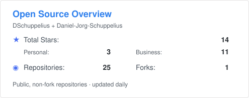

## GitHub & Open Source

<table width="100%">
  <tr>
    <th width="56%">Personal + Business</th>
    <th width="44%">Top Languages</th>
  </tr>
  <tr>
    <td width="56%" valign="top">
      <picture>
        <source media="(prefers-color-scheme: dark)" srcset="./profile/combined-overview-dark.svg">
        <source media="(prefers-color-scheme: light), (prefers-color-scheme: no-preference)" srcset="./profile/combined-overview-light.svg">
        
      </picture>
    </td>
    <td width="44%" valign="top">
      <picture>
        <source media="(prefers-color-scheme: dark)" srcset="./profile/personal-langs-dark.svg">
        <source media="(prefers-color-scheme: light), (prefers-color-scheme: no-preference)" srcset="./profile/personal-langs-light.svg">
        
      </picture>
    </td>
  </tr>
  <tr>
    <th colspan="2">GitHub Stats</th>
  </tr>
  <tr>
    <td colspan="2" valign="top">
      <picture>
        <source media="(prefers-color-scheme: dark)" srcset="./profile/personal-stats-dark.svg">
        <source media="(prefers-color-scheme: light), (prefers-color-scheme: no-preference)" srcset="./profile/personal-stats-light.svg">
        
      </picture>
    </td>
  </tr>
</table>

## Business-Projekte

Meine geschäftlichen Open-Source-Projekte und PHP-Bibliotheken werden in der GitHub-Organisation [Daniel-Jorg-Schuppelius](https://github.com/Daniel-Jorg-Schuppelius) entwickelt und gepflegt.

Dazu gehören unter anderem **DATEV-Integrationen, PHP-SDKs, API-Toolkits und weitere Komponenten für professionelle Softwareprojekte**.

### Ausgewählte Business-Projekte

- [datev-php-sdk](https://github.com/Daniel-Jorg-Schuppelius/datev-php-sdk)
- [lexoffice-php-sdk](https://github.com/Daniel-Jorg-Schuppelius/lexoffice-php-sdk)
- [orgamax-php-sdk](https://github.com/Daniel-Jorg-Schuppelius/orgamax-php-sdk)
- [php-api-toolkit](https://github.com/Daniel-Jorg-Schuppelius/php-api-toolkit)
